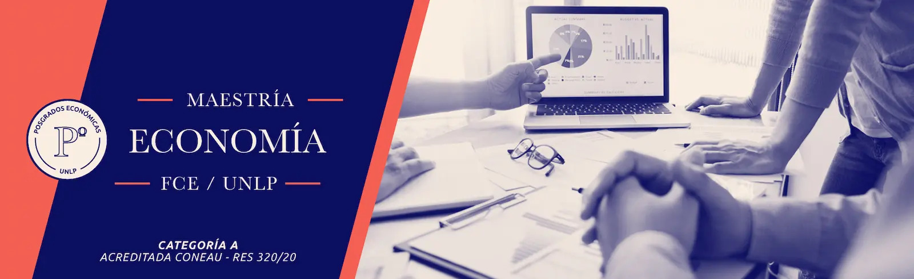

# Instrumentos Computacionales

¡Bienvenidos y bienvenidas! 🎉

Este es el repositorio oficial de la parte de **Stata** del **Seminario de Instrumentos Computacionales** de la Maestría en Economía de la Universidad Nacional de La Plata.

Nos alegra tenerte por acá. Este espacio fue pensado para acompañarte a lo largo del curso y facilitarte el acceso a todos los materiales que vas a necesitar.

---

## 📂 ¿Qué vas a encontrar acá?

- 📑 **Filminas del curso** — Las presentaciones utilizadas en cada clase, para que puedas repasar los contenidos cuando quieras.
- 💻 **Códigos de ejemplo** — Scripts y ejemplos prácticos que ilustran los temas vistos en clase, listos para explorar y adaptar.
- ✅ **Resolución de ejercicios prácticos** — Las soluciones a los ejercicios propuestos durante el curso, para que puedas comparar tu trabajo y afianzar lo aprendido.

---

## 📚 Otros Recursos

Materiales complementarios para profundizar los temas del curso.

### 🎥 Videos

Algunos videos recomendados en YouTube:

- 
- 

- 
- 
  
- 

### 🌐 Sitios Web

- [Nombre del sitio](https://example.com/) - Para consultar conceptos y ejemplos.
- [Documentación oficial](https://example.com/) - Referencia técnica y sintaxis.

### 🔗 Repositorios:

- [Stata packages](https://github.com/asjadnaqvi/The-Stata-Guide) - Utilidad práctica para organización o análisis.
- [Otro recurso](https://example.com/) - Complemento para trabajar de forma más eficiente.

---

¡Cualquier duda, no dudes en consultar! Éxitos
